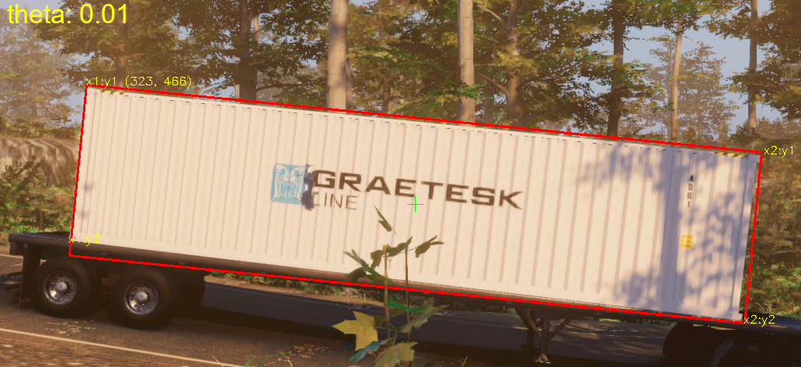

# Container Detection with Faster R-CNN

This repository contains the implementation of a **container detection** system using **Faster R-CNN** with a VGG16 backbone as used in the article [Faster R-CNN Unleashed: Crafting an End-to-End Solution for Damage Detection](https://stochasticcoder.com/2023/11/20/faster-r-cnn-unleashed-crafting-an-end-to-end-solution-for-damage-detection/). It includes the steps from data preparation to training and inferencing. The project leverages **PyTorch**, **MLflow** for experiment tracking, and **TensorBoard** for monitoring model training. The data preparation process includes capturing the bounding box rotation (theta) by identifying the corners of the polygonal segmentation of an object. The bbox and theta feature train the FRCNN model for detection and will be used for improving the precision of the damage detection and recognition model.




## Table of Contents

- [Overview](#overview)
- [Installation](#installation)
- [Usage](#usage)
  - [Preparing Data](#preparing-data)
  - [Training the Model](#training-the-model)
- [Experiments Tracking](#experiments-tracking)
- [License](#license)
- [Disclaimer](#disclaimer)


## Overview

This project focuses on detecting containers in images using the Faster R-CNN architecture. The pipeline includes:

1. Data preparation from annotated images.
2. Training and validating the model using a dataset of containers.
3. Experiment tracking with MLflow and visualization using TensorBoard.


## Installation

1. Create Python Environment
```bash
python -m venv venv
```

2. Activate Python Environment
```bash
venv\Scripts\activate
```

3. Install Pytorch (Cuda):

```bash
python -m pip install torch torchvision torchaudio --index-url https://download.pytorch.org/whl/cu117
```

4. Install the required Python dependencies:

```bash
python -m pip install -r requirements.txt
```


## Usage

### Preparing Data
Preparing the dataset involves two main steps. First, the object's rotation angle (theta) determined by identifying the corners of the polygonal segmentation of an object, ensuring the angle accurately reflects how the object is positioned in the image.

Second, a candidate dataset is created for training using selective search, which identifies potential object regions by grouping similar areas of the image.

To prepare the dataset for training, run the following command:

```bash
python container_detection.py --prep
```

This will load and process the annotated images into a format ready for training. Please note that data preparation using selective search may require a considerable amount of time.


### Training the Model

The project uses MLflow for tracking experiments. The trainer is looking for 'http://localhost:5000', which can be changed with the **tracking_uri**. Start the the MLflow server with the following command:


```bash
mlflow ui
```

To train the model, run:

```bash
python container_detection.py --train
```

This will load the prepared data, initialize the Faster R-CNN model, and begin the training process. The training progress will be tracked using TensorBoard and MLflow.


### Model Inferencing

After the model has been trained, you can perform inference on a batch of images by executing the following command:

<ins>Batch Inference Directory:</ins>
```bash
python container_detection.py --infer --path='<path>\data\captured_images'
```
-or-

<ins>Inference Single Image:</ins>
```bash
python container_detection.py --infer -path='<path>\data\captured_images\3_hill_9afe1737-21f7-4c2b-8576-225e79a06dbe_44R8_1.png'
```

## Experiments Tracking

This project leverages MLflow for comprehensive experiment tracking and TensorBoard for real-time training visualization.

To view experiment results in MLflow, including metrics, parameters, and model versions, open your browser and navigate to http://localhost:5000. This interface allows you to explore and compare various experiment runs, facilitating better management of model development.

<ins>Launch TensorBoard:</ins>
```bash
tensorboard --logdir=runs
```

For monitoring training progress with TensorBoard, open your browser and go to http://localhost:6006. TensorBoard provides detailed visualizations, including loss curves, accuracy metrics, and other insights, enabling you to track model performance throughout the training process.


## License
This project is licensed under the [MIT License](../LICENSE.md), granting permission for commercial and non-commercial use with proper attribution.


## Disclaimer
This project is offered exclusively for educational and demonstration purposes. While every effort has been made to ensure accuracy and functionality, it is provided "as-is" without any warranties or guarantees. Users are advised to exercise caution and assume full responsibility for any risks or outcomes associated with its use.

