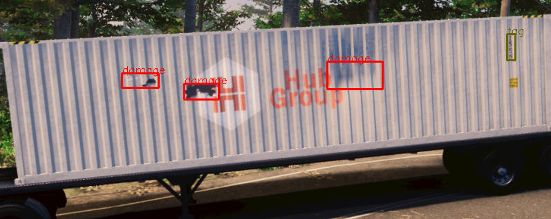

# Damage Detection with Faster R-CNN

This repository contains the implementation of a **damage detection** system  using a ResNet50-based **Faster R-CNN** as reviwed in the article [Faster R-CNN Unleashed: Crafting an End-to-End Solution for Damage Detection](https://stochasticcoder.com/2023/11/20/faster-r-cnn-unleashed-crafting-an-end-to-end-solution-for-damage-detection/). It includes the steps from data preparation to training and inferencing. The project leverages **PyTorch**, **MLflow** for experiment tracking, and **TensorBoard** for monitoring model training.  The use of Faster R-CNN enables efficient and precise damage assessment by focusing on relevant regions, while ResNet50 enhances feature extraction for better classification of damage versus non-damage elements.


## Table of Contents

- [Overview](#overview)
- [Installation](#installation)
- [Usage](#usage)
  - [Preparing Data](#preparing-data)
  - [Training the Model](#training-the-model)
  - [Model Inferencing](#model-inferencing)
- [Experiments Tracking](#experiments-tracking)
- [License](#license)
- [Disclaimer](#disclaimer)

<br/>

## Overview

This project focuses on detecting containers damage in images using the Faster R-CNN architecture.

Instance Segmentation polygons are captured using Azure Machine Learning [Data Labeling](https://learn.microsoft.com/en-us/azure/machine-learning/how-to-create-image-labeling-projects?view=azureml-api-2) and exported as COCO file for data prep.

1. Data preparation from annotated images.
2. Training and validating the model using a dataset of containers.
3. Experiment tracking with MLflow and visualization using TensorBoard.

<br/>

## Installation

1. Create Python Environment
```bash
python -m venv venv
```

<br/>


2. Activate Python Environment
```bash
venv\Scripts\activate
```

<br/>


3. Install Pytorch (Cuda):

```bash
python -m pip install torch torchvision torchaudio --index-url https://download.pytorch.org/whl/cu117
```

<br/>


4. Install the required Python dependencies:

```bash
python -m pip install -r requirements.txt
```

<br/>

5. :floppy_disk: **Download** the training data from: [Stochastic Coder - Training Faster-R-CNN-PyTorch-Damage-Detection.zip](https://stochasticcoder.com/wp-content/uploads/2024/09/Faster-R-CNN-PyTorch-Damage-Detection.zip) if not already downloaded and extracted. The code requires the training data to be organized within the **data/training** folder structure.

<br/>

## Usage

### Preparing Data
Preparing the dataset involves normalizing the bounding box and segmentation values relative to the image dimensions.

To prepare the dataset for training, run the following command:

```bash
python damage_detection.py --prep
```


---


### Training the Model

The project uses MLflow for tracking experiments. The trainer is looking for 'http://localhost:5000', which can be changed with the **tracking_uri**. Start the the MLflow server with the following command:


```bash
mlflow ui
```

To train the model, run:

```bash
python damage_detection.py --train
```

This will load the prepared data, initialize the Faster R-CNN model, and begin the training process. The training progress will be tracked using TensorBoard and MLflow.

---

### Model Inferencing

After the model has been trained, you can perform inference on a single image passing a single image file to the **infer_source** argument:

<ins>Inference Single Image:</ins>

```bash
python damage_detection.py --infer -infer_source='<path>\Faster-R-CNN-PyTorch-Damage-Detection\data\testing\container_images\2_hill_02fd9905-e47d-4f4f-a8e7-c821d0f40685_15SN_2.png' 
```

Running the above command will output the bounding box of the detected container (bbs) and rotation (theta).

```bash
[{'damage': [{'bbs': [475, 330, 555, 370]}, {'bbs': [268, 362, 318, 385]}, {'bbs': [178, 347, 231, 368]}], 'tags': [{'bbs': [735, 290, 747, 328]}], 'image_path': '<path>\\Faster-R-CNN-PyTorch-Damage-Detection\\data\\testing\\container_images\\2_hill_02fd9905-e47d-4f4f-a8e7-c821d0f40685_15SN_2.png'}]
```

Passing a directory to **infer_source** will batch process all images in the directory:

<ins>Batch Inference Directory:</ins>

```bash
python damage_detection.py --infer -infer_source='<path>\Faster-R-CNN-PyTorch-Damage-Detection\data\testing\container_images'
```

It is also possible to save the detected damage to an output directory by passing the output directory path to the **-infer_des** argument.

<ins>Inference with Output Images:</ins>

```bash
python damage_detection.py --infer -infer_source='<path>\Faster-R-CNN-PyTorch-Damage-Detection\data\testing\container_images\2_hill_02fd9905-e47d-4f4f-a8e7-c821d0f40685_15SN_2.png' -infer_dest='<path>\Faster-R-CNN-PyTorch-Damage-Detection\data\testing\container_damage'
```
Running the above command will add the output file path to the json results and write the extracted container to the specified path.

```bash
[{'damage': [{'bbs': [475, 330, 555, 370]}, {'bbs': [268, 362, 318, 385]}, {'bbs': [178, 347, 231, 368]}], 'tags': [{'bbs': [735, 290, 747, 328]}], 'image_path': '<path>\\Faster-R-CNN-PyTorch-Damage-Detection\\data\\testing\\container_images\\2_hill_02fd9905-e47d-4f4f-a8e7-c821d0f40685_15SN_2.png', 'output_file': '<path>\\Faster-R-CNN-PyTorch-Damage-Detection\\data\\testing\\container_damage\\2_hill_02fd9905-e47d-4f4f-a8e7-c821d0f40685_15SN_2.png'}]
```




<br/>

## Experiments Tracking

This project leverages MLflow for comprehensive experiment tracking and TensorBoard for real-time training visualization.

To view experiment results in MLflow, including metrics, parameters, and model versions, open your browser and navigate to http://localhost:5000. This interface allows you to explore and compare various experiment runs, facilitating better management of model development.

<ins>Launch TensorBoard:</ins>
```bash
tensorboard --logdir=runs
```

For monitoring training progress with TensorBoard, open your browser and go to http://localhost:6006. TensorBoard provides detailed visualizations, including loss curves, accuracy metrics, and other insights, enabling you to track model performance throughout the training process.

<br/>

## License
This project is licensed under the [MIT License](../LICENSE.md), granting permission for commercial and non-commercial use with proper attribution.

<br/>

## Disclaimer
This project is offered exclusively for educational and demonstration purposes. While every effort has been made to ensure accuracy and functionality, it is provided "as-is" without any warranties or guarantees. Users are advised to exercise caution and assume full responsibility for any risks or outcomes associated with its use.

